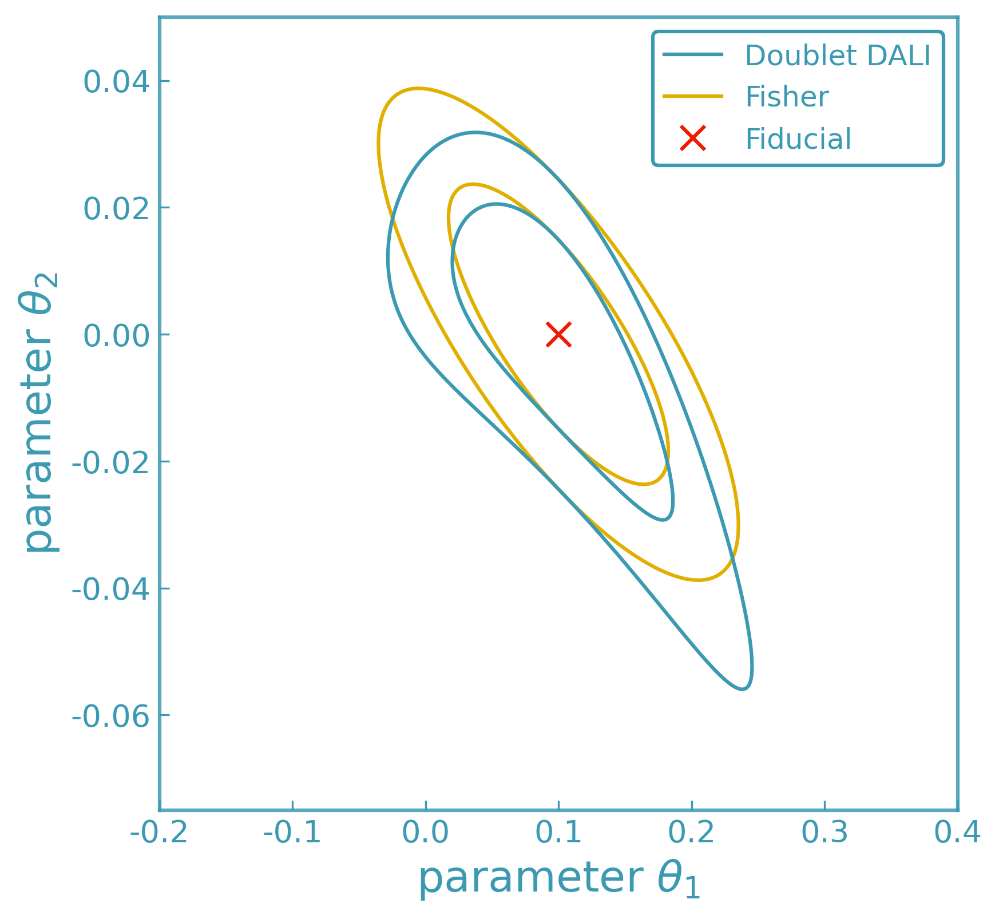

.. |dklogo| image:: ../../assets/logos/logo-black.png
   :alt: DerivKit logo black
   :width: 32px

|dklogo| ForecastKit
====================

ForecastKit provides derivative-based tools for local likelihood and posterior
analysis. It uses numerical derivatives to construct controlled approximations
to a model’s likelihood or posterior around a chosen expansion point.

The toolkit includes multiple Fisher-matrix formalisms, Fisher bias,
Laplace approximations, and higher-order DALI expansions. It also provides
utilities for contour visualization and posterior sampling based on these
local approximations.

All methods rely on DerivativeKit for numerical differentiation and work with
arbitrary user-defined models.

Runnable examples illustrating these methods are collected in
:doc:`../../examples/index`.

Fisher Information Matrix
-------------------------

The Fisher matrix [#fisher]_ quantifies how precisely model parameters can be determined
from a set of observables under a local Gaussian approximation.

Given:

- parameters :math:`\theta = (\theta_1, \theta_2, \ldots)`
- a model mapping parameters to observables :math:`\nu(\theta)`
- a data covariance matrix :math:`C`

ForecastKit computes the Jacobian

.. math::

   J_{i a} = \frac{\partial \nu_i}{\partial \theta_a},

using DerivativeKit and CalculusKit, and constructs the standard Fisher matrix

.. math::

   F = J^\top C^{-1} J.

The Fisher matrix can be inverted to yield the Cramér–Rao lower bound [#crlb]_
on the parameter covariance matrix under the assumption that the likelihood is
locally Gaussian near its maximum. In this approximation, the inverse Fisher
matrix provides a lower bound on the achievable variances of unbiased
parameter estimators, independent of the specific inference algorithm used.
As a result, Fisher matrix methods offer a fast and computationally efficient
way to forecast expected parameter constraints without performing full
likelihood sampling.

**Interpretation:**

The Fisher matrix provides a fast, local forecast of expected parameter constraints
under a Gaussian likelihood approximation.

**Example:**

A basic Fisher matrix computation is shown in :doc:`../../examples/forecasting/fisher`

Generalized Gaussian Fisher
---------------------------

When the data covariance depends on the model parameters, the standard Fisher
matrix must be generalized to include derivatives of both the mean and the
covariance [#gaussfisher]_.

For a Gaussian likelihood with mean
:math:`\mu(\theta) = \langle d \rangle`
and covariance
:math:`C(\theta) = \langle (d - \mu)(d - \mu)^{\mathrm T} \rangle`,
the Fisher matrix is

.. math::

   F_{\alpha\beta}
   =
   \frac{1}{2}
   \mathrm{Tr}
   \!\left[
     C^{-1} C_{,\alpha} C^{-1} C_{,\beta}
   \right]
   +
   \mu_{,\alpha}^{\mathrm T}
   C^{-1}
   \mu_{,\beta}.

Here :math:`C_{,\alpha} \equiv \partial C / \partial \theta_\alpha` and
:math:`\mu_{,\alpha} \equiv \partial \mu / \partial \theta_\alpha`.

This expression reduces to the standard Fisher matrix when the covariance
is independent of the parameters.

**Interpretation:**

The generalized Gaussian Fisher provides a consistent local approximation
when both the signal and noise depend on the model parameters.

**Example:**

A worked example is provided in :doc:`../../examples/forecasting/fisher_gauss`.

X–Y Fisher Formalism
--------------------

The X–Y Fisher formalism [#xyfisher]_ applies when the observables are naturally split into
measured inputs :math:`X` and outputs :math:`Y`, both of which are noisy and
possibly correlated.

The joint data covariance is written in block form as

.. math::

   C =
   \begin{pmatrix}
     C_{XX} & C_{XY} \\
     C_{XY}^{\mathrm T} & C_{YY}
   \end{pmatrix},

and the model predicts the expectation value of the outputs as
:math:`\mu(X, \theta)`.

Assuming the model can be linearized in the latent true inputs :math:`x`,

.. math::

   \mu(x) \simeq \mu(X) + T(X)\,(x - X),
   \qquad
   T_{ij} \equiv
   \frac{\partial \mu_i}{\partial x_j}\Big|_{x=X},

the latent variables can be marginalized analytically.

The resulting likelihood for :math:`Y` is Gaussian with an effective covariance

.. math::

   R
   =
   C_{YY}
   -
   C_{XY}^{\mathrm T} T^{\mathrm T}
   -
   T C_{XY}
   +
   T C_{XX} T^{\mathrm T}.

The Fisher matrix then takes the same form as the generalized Gaussian Fisher,
with the replacement :math:`C \rightarrow R`:

.. math::

   F_{\alpha\beta}
   =
   \frac{1}{2}
   \mathrm{Tr}
   \!\left[
     R^{-1} R_{,\alpha} R^{-1} R_{,\beta}
   \right]
   +
   \mu_{,\alpha}^{\mathrm T}
   R^{-1}
   \mu_{,\beta}.

**Interpretation:**

The X–Y Fisher matrix consistently propagates uncertainty in the measured
inputs into the output covariance, enabling Fisher forecasts when both inputs
and outputs are noisy.

**Example:**

A worked example is provided in :doc:`../../examples/forecasting/fisher_xy`.

Fisher Bias
-----------

Small systematic deviations in the observables can bias inferred parameters [#fisherbias]_.
These deviations are encoded as a difference data vector

.. math::

   \Delta \nu_i = \nu^{\mathrm{biased}}_i - \nu^{\mathrm{unbiased}}_i.

ForecastKit computes the first-order Fisher bias vector

.. math::

   b_a = \sum_{i,j} J_{i a}\, C^{-1}_{i j}\, \Delta \nu_j,

and the resulting parameter shift

.. math::

   \Delta \theta_a = \sum_b (F^{-1})_{a b}\, b_b.

ForecastKit returns:

- the bias vector
- the induced parameter shift
- optional visualization of the bias relative to Fisher contours

**Interpretation:**

Fisher bias estimates how small systematic errors in the observables translate
into shifts in best-fit parameters.

.. image:: ../../assets/plots/fisher_bias_demo_1and2sigma.png
   :width: 60%

**Example:**

A worked example is provided in :doc:`../../examples/forecasting/fisher_bias`.

Laplace Approximation
---------------------

The Laplace approximation [#laplace]_ replaces the posterior distribution near its maximum
by a multivariate Gaussian obtained from a second-order Taylor expansion of the
negative log-posterior.

Let the log-posterior be

.. math::

   \mathcal{L}(\theta)
   =
   -\ln p(\theta \mid d)
   =
   -\ln \mathcal{L}(d \mid \theta)
   -\ln p(\theta).

Expanding around the maximum a posteriori (MAP) point
:math:`\hat{\theta}`, where
:math:`\nabla \mathcal{L}(\hat{\theta}) = 0`, gives

.. math::

   \mathcal{L}(\theta)
   \simeq
   \mathcal{L}(\hat{\theta})
   +
   \frac{1}{2}
   (\theta - \hat{\theta})^{\mathrm T}
   H
   (\theta - \hat{\theta}),

where the Hessian matrix is

.. math::

   H_{ab}
   \equiv
   \left.
   \frac{\partial^2 \mathcal{L}}{\partial \theta_a \partial \theta_b}
   \right|_{\theta = \hat{\theta}}.

Under this approximation, the posterior is Gaussian,

.. math::

   p(\theta \mid d)
   \approx
   \mathcal{N}
   \!\left(
     \hat{\theta},
     \, H^{-1}
   \right),

with covariance given by the inverse Hessian of the negative log-posterior.

In the special case of a flat prior and a Gaussian likelihood, the Hessian
reduces to the Fisher information matrix, and the Laplace approximation
coincides with the Fisher forecast.

DALI (Higher-Order Forecasting)
-------------------------------

The DALI expansion (Derivative Approximation for LIkelihoods; [#dali]_) extends
Fisher and Laplace approximations by retaining higher-order derivatives of the
likelihood around a chosen expansion point.

Expanding the log-posterior locally in parameter displacements
:math:`\Delta\theta = \theta - \hat{\theta}`, DALI approximates the posterior as

.. math::

   \log p(\theta \mid d)
   \simeq
   \log p(\hat{\theta} \mid d)
   - \frac{1}{2}
     F_{\alpha\beta}\,
     \Delta\theta_\alpha \Delta\theta_\beta
   - \frac{1}{3!}
     D^{(1)}_{\alpha\beta\gamma}\,
     \Delta\theta_\alpha \Delta\theta_\beta \Delta\theta_\gamma
   - \frac{1}{4!}
     D^{(2)}_{\alpha\beta\gamma\delta}\,
     \Delta\theta_\alpha \Delta\theta_\beta
     \Delta\theta_\gamma \Delta\theta_\delta
   + \cdots,

where

- :math:`F_{\alpha\beta}` is the Fisher matrix,
- :math:`D^{(1)}_{\alpha\beta\gamma}` and :math:`D^{(2)}_{\alpha\beta\gamma\delta}`
  are the second-order (doublet) DALI correction terms,
- :math:`T^{(1)}_{\alpha\beta\gamma\delta}`,
  :math:`T^{(2)}_{\alpha\beta\gamma\delta\epsilon}`,
  and :math:`T^{(3)}_{\alpha\beta\gamma\delta\epsilon\zeta}`
  denote third-order (triplet) DALI correction terms,

all evaluated at the expansion point :math:`\hat{\theta}`.

For Gaussian data models with parameter-independent covariance, these tensors
can be expressed directly in terms of derivatives of the model predictions,
allowing DALI to be constructed using numerical derivatives alone.

At second order (“doublet DALI”), the posterior takes the form

.. math::

   p(\theta \mid d)
   \propto
   \exp\!\Bigg[
     -\frac{1}{2}
     F_{\alpha\beta}\,
     \Delta\theta_\alpha \Delta\theta_\beta
     -\frac{1}{2}
     D^{(1)}_{\alpha\beta\gamma}\,
     \Delta\theta_\alpha \Delta\theta_\beta \Delta\theta_\gamma
     +\frac{1}{8}
     D^{(2)}_{\alpha\beta\gamma\delta}\,
     \Delta\theta_\alpha \Delta\theta_\beta
     \Delta\theta_\gamma \Delta\theta_\delta
   \Bigg].

Including third-order (“triplet DALI”) terms introduces additional correction
tensors :math:`T^{(i)}`, which capture higher-order non-Gaussian structure while
preserving positive definiteness of the approximation.

**Interpretation:**

DALI provides a controlled hierarchy of local posterior approximations,
reducing to the Fisher and Laplace limits when higher-order derivatives vanish.

.. image:: ../../assets/plots/dali_vs_fisher_exact_1d.png
   :width: 60%

**Example:**

A worked example is provided in :doc:`../../examples/forecasting/dali`.

Posterior Sampling and Visualization
------------------------------------

ForecastKit provides utilities to draw samples directly from Fisher, Laplace,
or DALI-expanded posteriors and to convert them into GetDist-compatible [#getdist]_
``MCSamples`` objects.

This enables:

- posterior sampling based on local likelihood approximations using emcee [#emcee]_
- easy integration with GetDist for contour plotting and statistical summaries
- direct contour visualization and uncertainty propagation
- comparison between Fisher, Laplace, and DALI forecasts

These workflows are designed for forecasting and local posterior analysis,
providing fast and controlled approximations to parameter constraints without
requiring full likelihood evaluations with MCMC or nested sampling methods.

**Examples:**
Worked examples are provided in:
- :doc:`../../examples/forecasting/fisher_contours` for Fisher-based GetDist samples
- :doc:`../../examples/forecasting/dali_contours` for DALI-based posterior sampling
- :doc:`../../examples/forecasting/laplace_contours` for Laplace approximations

Backend Notes
-------------

- If ``method`` is omitted, the adaptive derivative backend is used.
- Any DerivativeKit backend may be selected
  (finite differences, Ridders, Gauss–Richardson, polynomial fits, etc.).
- Changing the derivative backend affects only how derivatives are computed,
  not the forecasting logic itself.

``ForecastKit`` is fully modular and designed to scale from simple Gaussian
forecasts to higher-order likelihood expansions with minimal code changes.

References
----------

.. [#fisher] Wikipedia, *Fisher information matrix*,
   https://en.wikipedia.org/wiki/Fisher_information
.. [#crlb] Wikipedia, *Cramér–Rao bound*,
   https://en.wikipedia.org/wiki/Cramér–Rao_bound
.. [#gaussfisher] M. Tegmark et al., *Karhunen-Loeve eigenvalue problems in cosmology: how should we tackle large data sets?*,
   https://arxiv.org/abs/1404.2854
.. [#xyfisher] A. Heavens et al., *Generalised Fisher Matrices*,
   https://arxiv.org/abs/1404.2854
.. [#dali] E. Sellentin et al., *Breaking the spell of Gaussianity: forecasting with higher order Fisher matrices*
   https://arxiv.org/abs/1401.6892
.. [#getdist] A. Lewis, *GetDist: a Python package for analysing Monte Carlo samples*,
   https://arxiv.org/abs/1910.13970
.. [#emcee] D. Foreman-Mackey et al., *emcee: The MCMC Hammer*,
   https://arxiv.org/abs/1202.3665
.. [#laplace] Wikipedia, *Laplace's approximation*,
   https://en.wikipedia.org/wiki/Laplace%27s_approximation
.. [#fisherbias] A. Amara and A. Réfrégier, *Systematic Bias in Cosmic Shear: Beyond the Fisher Matrix*,
   https://arxiv.org/abs/0710.5171
