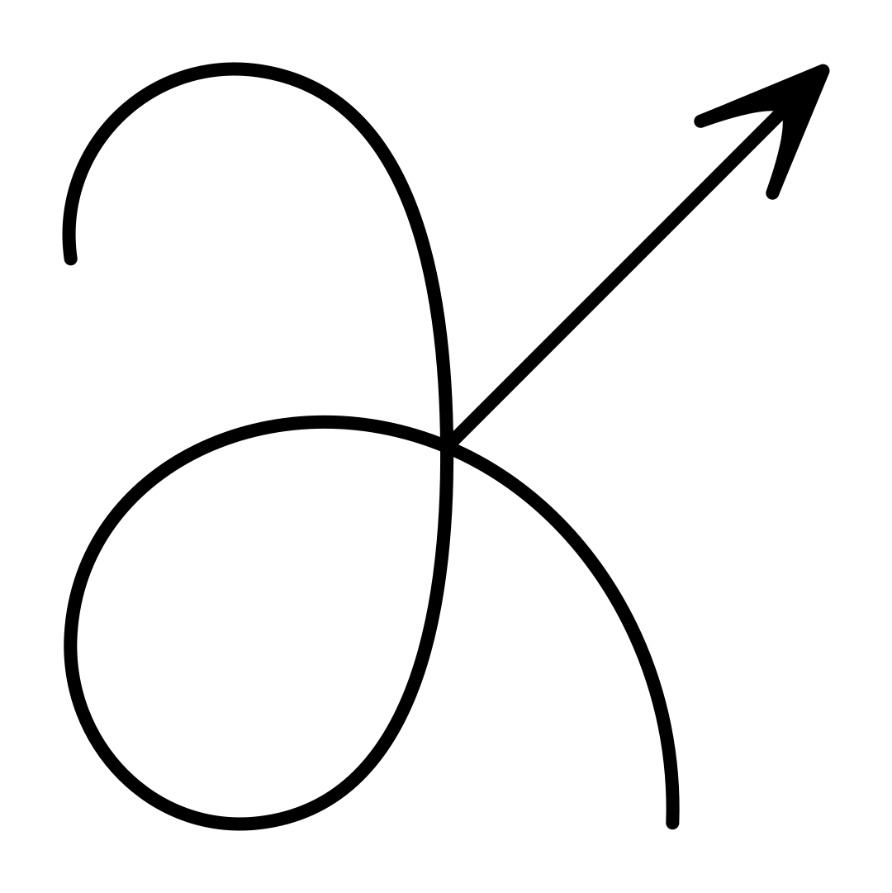

|dklogo| Fisher contours
========================

This page shows how to visualize Fisher-matrix forecasts using GetDist,
starting from a Fisher matrix computed with
:class:`derivkit.forecast_kit.ForecastKit`.

The focus here is what to do next once you already have a Fisher matrix:
how to turn it into confidence contours or samples for quick inspection,
comparison, and plotting.

If you are looking for:

- how the Fisher matrix is defined and interpreted, see
  :doc:`../../about/kits/forecast_kit`
- how to compute a Fisher matrix with DerivKit, see
  :doc:`fisher`

Two complementary visualization workflows are supported:

- passing an analytic Fisher Gaussian to GetDist, which handles sampling
  internally for visualization
- explicitly drawing samples from the Fisher Gaussian and returning them
  as :class:`getdist.MCSamples`

Both outputs can be passed directly to GetDist plotting utilities
(e.g. triangle / corner plots).

Analytic Gaussian
-----------------

Convert the Fisher matrix into an analytic Gaussian object compatible with
GetDist. The Gaussian distribution is passed directly to GetDist for
visualization, without explicitly drawing samples in DerivKit.

.. doctest:: fisher_getdist_gaussian

   >>> import numpy as np
   >>> from getdist import plots as getdist_plots
   >>> from derivkit import ForecastKit
   >>> # Define a simple toy model
   >>> def model(theta):
   ...     a, b = theta
   ...     return np.array([a, b, a + 2.0 * b], dtype=float)
   >>> # Fiducial parameters and covariance
   >>> theta0 = np.array([1.0, 2.0])
   >>> cov = np.eye(3)
   >>> # Compute Fisher matrix
   >>> fk = ForecastKit(function=model, theta0=theta0, cov=cov)
   >>> fisher = fk.fisher(
   ...     method="finite",
   ...     stepsize=1e-2,
   ...     num_points=5,
   ...     extrapolation="ridders",
   ...     levels=4,
   ... )
   >>> # Construct a Gaussian object for GetDist-managed sampling and visualization
   >>> gnd = fk.getdist_fisher_gaussian(
   ...     fisher=fisher,
   ...     names=["a", "b"],
   ...     labels=[r"a", r"b"],
   ...     label="Fisher (Gaussian)",
   ... )
   >>> # Plot Fisher ellipses in DerivKit red (rendered by the docs build)
   >>> dk_red = "#f21901"
   >>> line_width = 1.5
   >>> plotter = getdist_plots.get_subplot_plotter(width_inch=3.6)
   >>> plotter.settings.linewidth_contour = line_width
   >>> plotter.settings.linewidth = line_width
   >>> plotter.triangle_plot(
   ...     [gnd],
   ...     params=["a", "b"],
   ...     filled=[False],
   ...     contour_colors=[dk_red],
   ...     contour_lws=[line_width],
   ...     contour_ls=["-"],
   ... )
   >>> isinstance(gnd, object)
   True

.. plot::
   :include-source: False
   :width: 420

   import numpy as np
   from getdist import plots as getdist_plots
   from derivkit import ForecastKit

   def model(theta):
       a, b = theta
       return np.array([a, b, a + 2.0 * b], dtype=float)

   theta0 = np.array([1.0, 2.0])
   cov = np.eye(3)

   fk = ForecastKit(function=model, theta0=theta0, cov=cov)
   fisher = fk.fisher(
       method="finite",
       stepsize=1e-2,
       num_points=5,
       extrapolation="ridders",
       levels=4,
   )

   gnd = fk.getdist_fisher_gaussian(
       fisher=fisher,
       names=["a", "b"],
       labels=[r"a", r"b"],
       label="Fisher (Gaussian)",
   )

   dk_red = "#f21901"
   line_width = 1.5

   plotter = getdist_plots.get_subplot_plotter(width_inch=3.6)
   plotter.settings.linewidth_contour = line_width
   plotter.settings.linewidth = line_width

   plotter.triangle_plot(
       [gnd],
       params=["a", "b"],
       filled=[False],
       contour_colors=[dk_red],
       contour_lws=[line_width],
       contour_ls=["-"],
   )

Sampling from the Fisher Gaussian
---------------------------------

Alternatively, explicitly draw Monte Carlo samples from the Fisher Gaussian
and return them as a :class:`getdist.MCSamples` object. This provides direct
access to the samples for further analysis, applying bounds, or combining
with other samples.

.. doctest:: fisher_getdist_samples

   >>> import numpy as np
   >>> from getdist import plots as getdist_plots
   >>> from derivkit import ForecastKit
   >>> # Define a simple toy model
   >>> def model(theta):
   ...     a, b = theta
   ...     return np.array([a, b, a + 2.0 * b], dtype=float)
   >>> # Fiducial parameters and covariance
   >>> theta0 = np.array([1.0, 2.0])
   >>> cov = np.eye(3)
   >>> # Compute Fisher matrix
   >>> fk = ForecastKit(function=model, theta0=theta0, cov=cov)
   >>> fisher = fk.fisher(
   ...     method="finite",
   ...     stepsize=1e-2,
   ...     num_points=5,
   ...     extrapolation="ridders",
   ...     levels=4,
   ... )
   >>> # Draw samples from the Fisher Gaussian
   >>> samples = fk.getdist_fisher_samples(
   ...     fisher=fisher,
   ...     names=["a", "b"],
   ...     labels=[r"a", r"b"],
   ...     store_loglikes=True,
   ...     label="Fisher (samples)",
   ... )
   >>> # Plot sample-based contours in DerivKit red (rendered by the docs build)
   >>> dk_red = "#f21901"
   >>> line_width = 1.5
   >>> plotter = getdist_plots.get_subplot_plotter(width_inch=3.6)
   >>> plotter.settings.linewidth_contour = line_width
   >>> plotter.settings.linewidth = line_width
   >>> plotter.triangle_plot(
   ...     [samples],
   ...     params=["a", "b"],
   ...     filled=False,
   ...     contour_colors=[dk_red],
   ...     contour_lws=[line_width],
   ...     contour_ls=["-"],
   ... )
   >>> samples.numrows > 0
   True

.. plot::
   :include-source: False
   :width: 420

   import numpy as np
   from getdist import plots as getdist_plots
   from derivkit import ForecastKit

   def model(theta):
       a, b = theta
       return np.array([a, b, a + 2.0 * b], dtype=float)

   theta0 = np.array([1.0, 2.0])
   cov = np.eye(3)

   fk = ForecastKit(function=model, theta0=theta0, cov=cov)
   fisher = fk.fisher(
       method="finite",
       stepsize=1e-2,
       num_points=5,
       extrapolation="ridders",
       levels=4,
   )

   samples = fk.getdist_fisher_samples(
       fisher=fisher,
       names=["a", "b"],
       labels=[r"a", r"b"],
       store_loglikes=True,
       label="Fisher (samples)",
   )

   dk_red = "#f21901"
   line_width = 1.5

   plotter = getdist_plots.get_subplot_plotter(width_inch=3.6)
   plotter.settings.linewidth_contour = line_width
   plotter.settings.linewidth = line_width

   plotter.triangle_plot(
       [samples],
       params=["a", "b"],
       filled=False,
       contour_colors=[dk_red],
       contour_lws=[line_width],
       contour_ls=["-"],
   )

.. _fisher-including-priors:

Including Gaussian priors in Fisher forecast
--------------------------------------------

Gaussian priors can be included by adding their precision matrix
(the inverse prior covariance) to the Fisher matrix before converting to GetDist
objects. Below we overlay the original Fisher contours (red) with the
Fisher+prior contours (yellow).

.. doctest:: fisher_with_gaussian_prior_overlay

   >>> import numpy as np
   >>> from getdist import plots as getdist_plots
   >>> from derivkit import ForecastKit
   >>> np.set_printoptions(precision=8, suppress=True)
   >>> # Same toy model as above
   >>> def model(theta):
   ...     a, b = theta
   ...     return np.array([a, b, a + 2.0 * b], dtype=float)
   >>> theta0 = np.array([1.0, 2.0])
   >>> cov = np.eye(3)
   >>> # Fisher from the example above
   >>> fk = ForecastKit(function=model, theta0=theta0, cov=cov)
   >>> fisher_like = fk.fisher()
   >>> # Gaussian prior: sigma_a = 0.6, sigma_b = 0.8 (diagonal prior covariance)
   >>> sigma_prior = np.array([0.6, 0.8], dtype=float)
   >>> fisher_prior = np.diag(1.0 / sigma_prior**2)
   >>> fisher_post = fisher_like + fisher_prior
   >>> # Convert both to analytic GetDist Gaussians
   >>> g_like = fk.getdist_fisher_gaussian(
   ...     fisher=fisher_like,
   ...     names=["a", "b"],
   ...     labels=[r"a", r"b"],
   ...     label="Fisher",
   ... )
   >>> g_post = fk.getdist_fisher_gaussian(
   ...     fisher=fisher_post,
   ...     names=["a", "b"],
   ...     labels=[r"a", r"b"],
   ...     label="Fisher + Gaussian prior",
   ... )
   >>> # Overlay contours: red (likelihoods-only) and yellow (with prior)
   >>> dk_red = "#f21901"
   >>> dk_yellow = "#f2b701"
   >>> line_width = 1.5
   >>> plotter = getdist_plots.get_subplot_plotter(width_inch=3.6)
   >>> plotter.settings.linewidth_contour = line_width
   >>> plotter.settings.linewidth = line_width
   >>> plotter.settings.figure_legend_frame = False
   >>> plotter.settings.legend_rect_border = False
   >>> plotter.triangle_plot(
   ...     [g_like, g_post],
   ...     params=["a", "b"],
   ...     filled=[False, False],
   ...     contour_colors=[dk_red, dk_yellow],
   ...     contour_lws=[line_width, line_width],
   ...     contour_ls=["-", "-"],
   ... )
   >>> (g_like is not None) and (g_post is not None)
   True

.. plot::
   :include-source: False
   :width: 420

   import numpy as np
   from getdist import plots as getdist_plots
   from derivkit import ForecastKit

   def model(theta):
       a, b = theta
       return np.array([a, b, a + 2.0 * b], dtype=float)

   theta0 = np.array([1.0, 2.0])
   cov = np.eye(3)

   fk = ForecastKit(function=model, theta0=theta0, cov=cov)
   fisher_like = fk.fisher()

   sigma_prior = np.array([0.6, 0.8], dtype=float)
   fisher_prior = np.diag(1.0 / sigma_prior**2)
   fisher_post = fisher_like + fisher_prior

   g_like = fk.getdist_fisher_gaussian(
       fisher=fisher_like,
       names=["a", "b"],
       labels=[r"a", r"b"],
       label="Fisher",
   )
   g_post = fk.getdist_fisher_gaussian(
       fisher=fisher_post,
       names=["a", "b"],
       labels=[r"a", r"b"],
       label="Fisher + Gaussian prior",
   )

   dk_red = "#f21901"
   dk_yellow = "#f2b701"
   line_width = 1.5

   plotter = getdist_plots.get_subplot_plotter(width_inch=3.6)
   plotter.settings.linewidth_contour = line_width
   plotter.settings.linewidth = line_width
   plotter.settings.figure_legend_frame = False
   plotter.settings.legend_rect_border = False

   plotter.triangle_plot(
       [g_like, g_post],
       params=["a", "b"],
       filled=[False, False],
       contour_colors=[dk_red, dk_yellow],
       contour_lws=[line_width, line_width],
       contour_ls=["-", "-"],
   )

Including correlated Gaussian priors
------------------------------------

A correlated Gaussian prior can be included by adding its precision matrix
to the Fisher matrix. Unlike a diagonal prior, a correlated prior contains
off-diagonal covariance terms and can therefore change the orientation of
the resulting confidence contours.

Below, the Fisher-only contours (red) are compared with those obtained
after including a correlated Gaussian prior (yellow).

The ``prior_gaussian`` utility constructs the corresponding log-prior,
while its covariance is used directly to update the Fisher matrix.
The prior mean is set to the fiducial point ``theta0``, so the
posterior Gaussian remains centered there.

.. doctest:: fisher_correlated_gaussian_prior

   >>> import numpy as np
   >>> from getdist import plots as getdist_plots
   >>> from derivkit import ForecastKit
   >>> from derivkit.forecasting.priors_core import prior_gaussian
   >>> def model(theta):
   ...     a, b = theta
   ...     return np.array([a, b, a + 2.0 * b], dtype=float)
   >>> theta0 = np.array([1.0, 2.0])
   >>> fk = ForecastKit(function=model, theta0=theta0, cov=np.eye(3))
   >>> fisher_like = fk.fisher()
   >>> sigma_a, sigma_b, rho = 0.6, 0.8, -0.7
   >>> cov_prior = np.array([
   ...     [sigma_a**2, rho * sigma_a * sigma_b],
   ...     [rho * sigma_a * sigma_b, sigma_b**2],
   ... ])
   >>> logprior = prior_gaussian(mean=theta0, cov=cov_prior)
   >>> fisher_post = fisher_like + np.linalg.inv(cov_prior)
   >>> g_like = fk.getdist_fisher_gaussian(
   ...     fisher=fisher_like, names=["a", "b"], labels=[r"a", r"b"],
   ...     label="Fisher",
   ... )
   >>> g_post = fk.getdist_fisher_gaussian(
   ...     fisher=fisher_post, names=["a", "b"], labels=[r"a", r"b"],
   ...     label="Fisher + correlated prior",
   ... )
   >>> dk_red = "#f21901"
   >>> dk_yellow = "#f2b701"
   >>> line_width = 1.5
   >>> plotter = getdist_plots.get_subplot_plotter(width_inch=3.6)
   >>> plotter.settings.linewidth_contour = line_width
   >>> plotter.settings.linewidth = line_width
   >>> plotter.triangle_plot(
   ...     [g_like, g_post], params=["a", "b"], filled=[False, False],
   ...     contour_colors=[dk_red, dk_yellow],
   ...     contour_lws=[line_width, line_width], contour_ls=["-", "-"],
   ... )
   >>> bool(np.isclose(logprior(theta0), 0.0))
   True

.. plot::
   :include-source: False
   :width: 420

   import numpy as np
   from getdist import plots as getdist_plots
   from derivkit import ForecastKit
   from derivkit.forecasting.priors_core import prior_gaussian

   def model(theta):
       a, b = theta
       return np.array([a, b, a + 2.0 * b], dtype=float)

   theta0 = np.array([1.0, 2.0])
   fk = ForecastKit(function=model, theta0=theta0, cov=np.eye(3))
   fisher_like = fk.fisher()

   sigma_a, sigma_b, rho = 0.6, 0.8, -0.7
   cov_prior = np.array([
       [sigma_a**2, rho * sigma_a * sigma_b],
       [rho * sigma_a * sigma_b, sigma_b**2],
   ])
   logprior = prior_gaussian(mean=theta0, cov=cov_prior)
   fisher_post = fisher_like + np.linalg.inv(cov_prior)

   g_like = fk.getdist_fisher_gaussian(
       fisher=fisher_like, names=["a", "b"], labels=[r"a", r"b"],
       label="Fisher",
   )
   g_post = fk.getdist_fisher_gaussian(
       fisher=fisher_post, names=["a", "b"], labels=[r"a", r"b"],
       label="Fisher + correlated prior",
   )

   dk_red = "#f21901"
   dk_yellow = "#f2b701"
   line_width = 1.5

   plotter = getdist_plots.get_subplot_plotter(width_inch=3.6)
   plotter.settings.linewidth_contour = line_width
   plotter.settings.linewidth = line_width
   plotter.triangle_plot(
       [g_like, g_post], params=["a", "b"], filled=[False, False],
       contour_colors=[dk_red, dk_yellow],
       contour_lws=[line_width, line_width], contour_ls=["-", "-"],
   )

Including uniform (top-hat) priors
-----------------------------------

Uniform priors restrict parameters to a specified region of parameter
space. Within the allowed region, the prior density is constant; outside
it, the probability is zero.

Unlike Gaussian priors, hard bounds cannot generally be incorporated
by adding a precision matrix to the Fisher matrix. Instead, the
Fisher-Gaussian distribution must be truncated when constructing samples.

The example below uses DerivKit's ``prior_uniform`` to impose relatively
weak bounds and compares the original Fisher contours (red) with the
truncated distribution (yellow). Unlike Gaussian priors, uniform priors
do not continuously tighten the posterior within their allowed region;
they only exclude parameter values outside their bounds.

.. doctest:: fisher_uniform_prior

   >>> import numpy as np
   >>> from getdist import MCSamples, plots as getdist_plots
   >>> from derivkit import ForecastKit
   >>> from derivkit.forecasting.priors_core import prior_uniform
   >>> def model(theta):
   ...     a, b = theta
   ...     return np.array([a, b, a + 2.0 * b], dtype=float)
   >>> theta0 = np.array([1.0, 2.0])
   >>> fk = ForecastKit(function=model, theta0=theta0, cov=np.eye(3))
   >>> fisher = fk.fisher()
   >>> cov_fisher = np.linalg.inv(fisher)
   >>> sigma = np.sqrt(np.diag(cov_fisher))
   >>> bounds = [
   ...     (theta0[0] - 2.7 * sigma[0], theta0[0] + 4.0 * sigma[0]),
   ...     (theta0[1] - 4.0 * sigma[1], theta0[1] + 4.0 * sigma[1]),
   ... ]
   >>> logprior = prior_uniform(bounds=bounds)
   >>> rng = np.random.default_rng(42)
   >>> draws = rng.multivariate_normal(theta0, cov_fisher, size=100_000)
   >>> mask = np.array([np.isfinite(logprior(theta)) for theta in draws])
   >>> truncated = draws[mask]
   >>> samples_like = MCSamples(
   ...     samples=draws, names=["a", "b"], labels=[r"a", r"b"],
   ...     label="Fisher",
   ... )
   >>> samples_prior = MCSamples(
   ...     samples=truncated, names=["a", "b"], labels=[r"a", r"b"],
   ...     ranges={"a": list(bounds[0]), "b": list(bounds[1])},
   ...     label="Fisher + uniform prior",
   ... )
   >>> dk_red = "#f21901"
   >>> dk_yellow = "#f2b701"
   >>> line_width = 1.5
   >>> plotter = getdist_plots.get_subplot_plotter(width_inch=3.6)
   >>> plotter.settings.linewidth_contour = line_width
   >>> plotter.settings.linewidth = line_width
   >>> plotter.triangle_plot(
   ...     [samples_like, samples_prior], params=["a", "b"],
   ...     filled=[False, False], contour_colors=[dk_red, dk_yellow],
   ...     contour_lws=[line_width, line_width], contour_ls=["-", "-"],
   ... )
   >>> bool(np.all((truncated >= np.array(bounds)[:, 0]) &
   ...             (truncated <= np.array(bounds)[:, 1])))
   True

.. plot::
   :include-source: False
   :width: 420

   import numpy as np
   from getdist import MCSamples, plots as getdist_plots
   from derivkit import ForecastKit
   from derivkit.forecasting.priors_core import prior_uniform

   def model(theta):
       a, b = theta
       return np.array([a, b, a + 2.0 * b], dtype=float)

   theta0 = np.array([1.0, 2.0])
   fk = ForecastKit(function=model, theta0=theta0, cov=np.eye(3))
   fisher = fk.fisher()
   cov_fisher = np.linalg.inv(fisher)
   sigma = np.sqrt(np.diag(cov_fisher))
   bounds = [
       (theta0[0] - 2.7 * sigma[0], theta0[0] + 4.0 * sigma[0]),
       (theta0[1] - 4.0 * sigma[1], theta0[1] + 4.0 * sigma[1]),
   ]
   logprior = prior_uniform(bounds=bounds)

   rng = np.random.default_rng(42)
   draws = rng.multivariate_normal(theta0, cov_fisher, size=100_000)
   mask = np.array([np.isfinite(logprior(theta)) for theta in draws])
   truncated = draws[mask]

   samples_like = MCSamples(
       samples=draws, names=["a", "b"], labels=[r"a", r"b"],
       label="Fisher",
   )
   samples_prior = MCSamples(
       samples=truncated, names=["a", "b"], labels=[r"a", r"b"],
       ranges={"a": list(bounds[0]), "b": list(bounds[1])},
       label="Fisher + uniform prior",
   )

   dk_red = "#f21901"
   dk_yellow = "#f2b701"
   line_width = 1.5

   plotter = getdist_plots.get_subplot_plotter(width_inch=3.6)
   plotter.settings.linewidth_contour = line_width
   plotter.settings.linewidth = line_width
   plotter.triangle_plot(
       [samples_like, samples_prior], params=["a", "b"],
       filled=[False, False], contour_colors=[dk_red, dk_yellow],
       contour_lws=[line_width, line_width], contour_ls=["-", "-"],
   )

Notes and conventions
---------------------

- The Fisher matrix is inverted using a pseudo-inverse to form the Gaussian
  covariance; regularization can be controlled via ``rcond``.
- ``getdist.MCSamples.loglikes`` stores minus the log-posterior (up to an
  additive constant), following GetDist conventions.
- Sampler bounds and priors are optional and intended for light truncation, not for
  defining complex posteriors.
- Sampling-based Fisher contours are estimated via kernel density methods and may
  appear slightly irregular even for large sample sizes (e.g. ``n_samples=100_000``).
  This is expected and does not indicate an issue with the Fisher matrix itself.
- For strongly non-Gaussian posteriors or curved degeneracies, consider using
  the DALI expansion or a full sampler instead.

See also
--------

- :class:`derivkit.forecast_kit.ForecastKit`
- :func:`derivkit.forecast_kit.ForecastKit.fisher`
- :func:`derivkit.forecast_kit.ForecastKit.getdist_fisher_gaussian`
- :func:`derivkit.forecast_kit.ForecastKit.getdist_fisher_samples`
