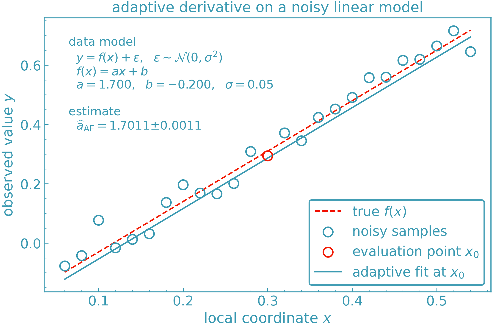

Derivative Methods
==================

DerivKit implements several complementary derivative engines. Each has different
strengths depending on smoothness, noise level, and computational cost.

This page gives an overview of the main methods, how they work, and when to use
which one.

Finite Differences
------------------
**Status:** Implemented

**Idea:**
Estimate the slope by evaluating the function at points around ``x0`` and forming
a central-difference stencil [#fdiff]_.

**Features:**

- 3, 5, 7, 9-point central stencils
- Richardson extrapolation [#richardsonwiki]_ (reduces truncation error)
- Ridders extrapolation [#ridderswiki]_ (adaptive error control)
- Gauss–Richardson (GRE) [#gre]_ (noise-robust variant)

**Use When:**

- The function is smooth and cheap to evaluate
- Noise is low or moderate
- You want fast, reliable derivatives

**Pros:** Fast, simple, accurate for smooth functions
**Cons:** Sensitive to noise; step-size tuning matters

Simple Polynomial Fit
---------------------
**Status:** Implemented

**Idea:**
Sample points in a small, user-controlled window around ``x0`` and fit a
fixed-order polynomial (e.g. quadratic or cubic) on a simple grid. The
derivative at ``x0`` is taken from the analytic derivative of that polynomial
[#fornberg]_.

**Features**

- User-chosen window and polynomial degree
- Low overhead and easy to reason about
- No diagnostics beyond basic failures

**Best for:** smooth functions, light noise, quick approximations
**Pros:** smoother than raw finite differences, cheap
**Cons:** not designed to handle strong noise or badly conditioned fits

Adaptive Polynomial Fit (Chebyshev)
-----------------------------------
**Status:** Implemented

**Idea:**
Build a Chebyshev-spaced grid around ``x0`` (optionally domain-aware), rescale
offsets to a stable interval, and fit a local polynomial with optional ridge
regularisation. The method can enlarge the grid if there are too few samples,
adjust the effective polynomial degree, and reports detailed diagnostics
[#fornberg]_.

**Sampling strategy**

- Default: symmetric Chebyshev nodes around ``x0`` with automatic half-width
  (via ``spacing="auto"`` and ``base_abs``)
- Domain-aware: interval is clipped to stay inside a given ``(lo, hi)`` domain
- Custom grids: user can supply explicit offsets or absolute sample locations

**Stability / diagnostics**

- Scales offsets before fitting to reduce conditioning
- Optional ridge term to stabilise ill-conditioned Vandermonde systems
- Checks fit quality and flags “obviously bad” derivatives with suggestions
- Optional diagnostics dict with sampled points, fit metrics, and metadata

**Best for:** noisy, irregular, or delicate functions where naive finite
differences misbehave

**Pros:**

- Chebyshev nodes + scaling give numerically stable fits
- Adaptive behaviour (grid rebuild, degree reduction) avoids catastrophic failures
- Rich diagnostics for debugging bad derivatives

**Cons:**

- More overhead than finite differences or simple polyfit
- Slightly more configuration (spacing, ridge, domain) if you want fine control

Cheat Sheet: Choosing the Right Method
--------------------------------------

+------------------------------+------------------------------+--------------------------------------------------------+
| **Situation**                | **Recommended Method**       | **Why**                                                |
+==============================+==============================+========================================================+
| Smooth, cheap function       | Finite Difference            | Fast and accurate for clean functions                  |
+------------------------------+------------------------------+--------------------------------------------------------+
| Slightly noisy function      | Ridders Finite Difference    | Richardson + error control stabilises noise            |
+------------------------------+------------------------------+--------------------------------------------------------+
| Moderate or structured noise | Simple Polynomial Fit        | Local regression smooths noise better than FD          |
+------------------------------+------------------------------+--------------------------------------------------------+
| High noise / messy signal    | Adaptive PolyFit (Chebyshev) | Robust trimming, Chebyshev grid, diagnostics           |
+------------------------------+------------------------------+--------------------------------------------------------+
| Expensive function           | Adaptive PolyFit (Chebyshev) | Fewer evaluations and stable fit around ``x0``         |
+------------------------------+------------------------------+--------------------------------------------------------+
| Need robustness + diagnostics| Adaptive PolyFit (Chebyshev) | Fit quality metrics, degree adjustment, suggestions    |
+------------------------------+------------------------------+--------------------------------------------------------+

Example: Adaptive Fit on a Noisy Function
-----------------------------------------

Below is a visual example of the :py:mod:`derivkit.adaptive_fit` module estimating
the first derivative of a nonlinear function in the presence of noise. The method
selectively discards outlier points before fitting a polynomial, resulting in a
robust and smooth estimate.

Experimental: JAX autodiff (opt-in)
-----------------------------------

DerivKit also exposes optional JAX-based automatic differentiation utilities.
These are **not registered as an official DerivKit derivative method by default**
and must be explicitly enabled by the user.

This functionality is intended for quick, informal comparisons or sanity checks against
DerivKit’s numerical methods when the model is smooth and already written in terms of ``jax.numpy`.
It is *not* designed for noisy, tabulated, or black-box functions, and should
not be relied upon for production inference or robustness studies.

In most scientific use cases targeted by DerivKit, the adaptive or finite
difference methods above are more appropriate.

Installation and usage details are described in :doc:`guide/installation`.

References
----------

.. [#fdiff] Wikipedia, *Numerical differentiation – Finite differences*,
   <https://en.wikipedia.org/wiki/Numerical_differentiation#Finite_differences>
.. [#fornberg] B. Fornberg,
   *High-Accuracy Finite Difference Methods*, Cambridge University Press, 2025.
   https://www.cambridge.org/core/books/highaccuracy-finite-difference-methods/F894ADC234A8CCB286DE8C8B43B1E2AA
.. [#gre] C. J. Oates, T. Karvonen, A. L. Teckentrup, M. Strocchi, and S. A. Niederer,
   "Probabilistic Richardson Extrapolation",
   *arXiv:2401.07562*, 2024. https://arxiv.org/abs/2401.07562
.. [#richardsonwiki] Wikipedia,
   "Richardson extrapolation",
   https://en.wikipedia.org/wiki/Richardson_extrapolation
.. [#ridderswiki] Wikipedia,
   "Ridders' method",
   https://en.wikipedia.org/wiki/Ridders%27_method
