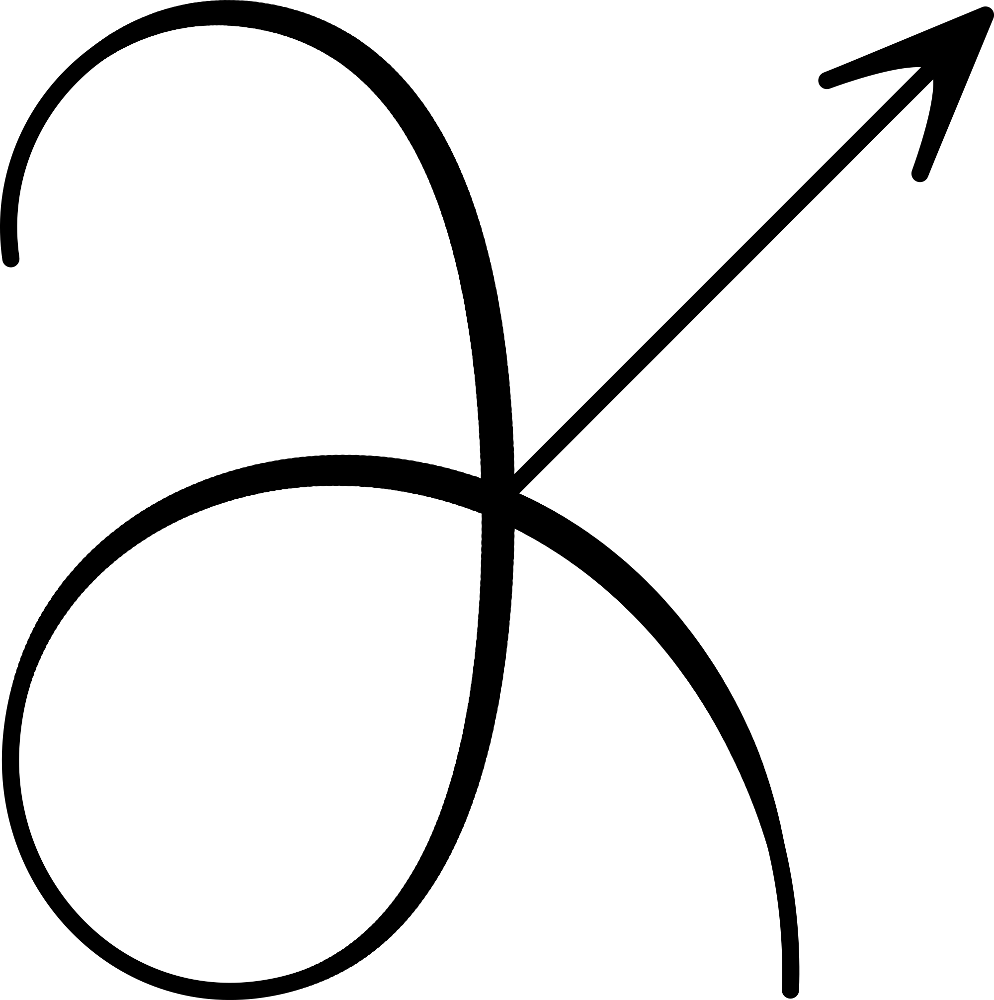

.. Derivkit documentation master file, created by
   sphinx-quickstart on Wed Aug 20 20:21:28 2025.
   You can adapt this file completely to your liking, but it should at least
   contain the root `toctree` directive.

DerivKit
========

Reliable numerical derivatives and derivative-based forecasting for
scientific computing.

DerivKit is a modular toolkit designed for workflows where numerical
derivatives must be computed explicitly and robustly. It provides a common
foundation for derivative-based methods, together with higher-level tools for
calculus, forecasting, and likelihood analysis.

DerivKit is particularly suited to applications in physics, astronomy, and
cosmology, where models are often noisy, computationally expensive, or non-smooth, and where
automatic differentiation may be unavailable or inappropriate.

.. toctree::
   :maxdepth: 2
   :caption: User Guide
   :hidden:

   about/index
   installation
   examples/index
   workflows
   citation
   contributing
   team
   license
   api/index

What does DerivKit provide?
---------------------------

DerivKit is organized into four interoperable layers:

- **DerivativeKit** for robust numerical differentiation
- **CalculusKit** for gradients, Jacobians, Hessians, and mixed partials
- **ForecastKit** for Fisher matrices, Fisher bias, Laplace, and DALI expansions
- **LikelihoodKit** for lightweight likelihood utilities that integrate with
  derivative-based workflows

Each layer can be used independently, while sharing a common derivative backend
to ensure consistent numerical behavior throughout the library.

If you want to jump straight to usage, start with :doc:`examples/index`.
